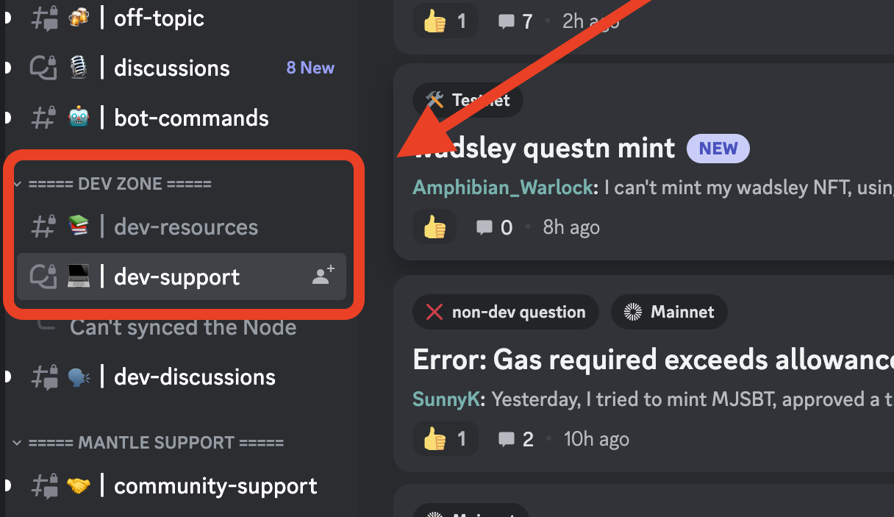

# Developer Tutorials

Welcome to the builder's section of Mantle Repository!

This readMe file serves as a one-stop library to find all the relevant tutorials to get started with building on Mantle.

All tutorials listed below are built either using Mantle SDK or supported third-party tools.
</br>

### Learning Platform

- [**Hackquest x Mantle Devs Tutorial**](https://www.mantle.hackquest.io/)

### Explorer

- [How to verify Contracts via Explorer](https://docs-v2.mantle.xyz/devs/dev-hubs/how-to/verify/explorer)

### Developer Guide

- [Deploy Your Smart Contract to Mantle Network](https://docs-v2.mantle.xyz/devs/dev-hubs/how-to/deploy/remix)

</br>

## Mantle SDK Tutorials

- [`cross-dom-bridge-mnt`](./cross-dom-bridge-mnt/README.md)

- [`cross-dom-bridge-erc20`](./cross-dom-bridge-erc20/README.md)

- [`cross-dom-bridge-eth`](./cross-dom-bridge-eth/README.md)

- [`cross-dom-comm`](./cross-dom-comm/README.md)

- [`sdk-estimate-gas`](./sdk-estimate-gas/README.md)

- [`sdk-view-tx`](./sdk-view-tx/README.md)

- [`standard-bridge-standard-token`](./standard-bridge-standard-token/README.md)

- [`view-interlayer-transaction`](https://www.mantle.xyz/blog/developers/how-to-view-interlayer-transactions)

</br>

### Build LOCAL ENV

All tutorials can run in local enviroment,you can build local network enviroment with follow steps.

1. Ensure your computer has:

   - [`git`](https://git-scm.com/downloads)
   - [`node`](https://nodejs.org/en/)
   - [`yarn`](https://classic.yarnpkg.com/lang/en/docs/install/#mac-stable)

1. Start local L1 and L2:
   ```sh
   git clone https://github.com/mantlenetworkio/mantle-v2.git
   cd mantle/ops
   make up
   # check status
   make ps
   ```

</br>

## Developer Support

🛑 Have doubts and need support?

✅ Join our Discord Server and raise a ticket under "DEV ZONE" and raise a ticket for help from the support enginners!

[](https://discord.gg/0xmantle)
[](https://t.me/mantledevs)



Feel free to ping the DevRel on Discord or Telegram for any further questions or interact with other blockchain developers and fellow builders!

Happy Building! 🫡
